# Lëk

Lëk is a machine-learning early warning system that predicts food price inflation in South Sudan and delivers warnings over SMS and USSD to citizens on basic phones, with an admin dashboard for monitoring.

## Live links

- Dashboard: https://lek-dashboard.onrender.com
- Backend API: https://lek-backend.onrender.com
- ML service API docs: https://lek-ml-service.onrender.com/docs
- Demo video: https://drive.google.com/file/d/1HTU4Tg78og37Z3i6tSdGC0Q9CBSlXnxa/view?usp=sharing

All services run on Render's free tier. A service that has been idle spins down, so the first request after a period of inactivity can take up to about 50 seconds to respond while it wakes up. Subsequent requests are fast.

## Features

- National food price inflation forecasting using an XGBoost model that predicts the next month's change in the national food price index.
- SMS warnings sent through Africa's Talking. When no API key is configured the service runs in a simulated mode that logs messages instead of sending them, so the pipeline works end to end without credentials.
- USSD menu (Africa's Talking sandbox code `*384*9509#`) that lets a citizen on a basic phone register for alerts, check the risk for their county, and unsubscribe.
- Admin dashboard for viewing predictions, managing users, and reviewing alerts, including a function to send a test alert SMS to a chosen number.
- Role-based access control with a single superadmin account that manages the other admin accounts. New accounts are always created with the `admin` role; the superadmin cannot be created, promoted to, or deleted through the API.

## Tech stack

| Layer | Technology |
|---|---|
| ML service | Python, FastAPI, XGBoost |
| Backend | Node.js, Express, PostgreSQL |
| Dashboard | React, Vite, Tailwind |
| Messaging | Africa's Talking (SMS and USSD) |
| Deployment | Render (render.yaml blueprint) |

## Architecture

```
                  ┌─────────────────────┐
                  │   Africa's Talking  │
                  │     SMS / USSD      │
                  └──────────┬──────────┘
                             │  (SMS out, USSD callbacks in)
                             ▼
  ┌───────────────┐    ┌───────────────┐    ┌───────────────┐
  │   Dashboard   │───▶│    Backend    │───▶│  ML service   │
  │ React + Vite  │    │ Express + API │    │ FastAPI + XGB │
  └───────────────┘    └───────┬───────┘    └───────────────┘
                               │
                               ▼
                        ┌───────────────┐
                        │  PostgreSQL   │
                        └───────────────┘
```

The dashboard is a thin client: it only ever talks to the backend API and holds no business logic of its own. The backend is the hub. It calls the ML service for forecasts, reads and writes application state in PostgreSQL, and exchanges messages with Africa's Talking, sending outbound SMS alerts and handling inbound USSD session callbacks. Forecasts from the model are national; the per-county figures shown in the dashboard and over USSD are derived from the national prediction.

## Running locally

The application lives in the `lek/` subfolder of this repository. The commands below assume you have changed into that folder after cloning.

### Prerequisites

- Node.js (18 or newer)
- Python 3.12
- PostgreSQL (14 or newer)

### 1. Clone and enter the app folder

```bash
git clone https://github.com/James-Jok-Akuei/Lek.git
cd Lek/lek
```

### 2. Database

Create the database and load the schema and seed data (the 10 South Sudan states):

```bash
createdb lek
psql -d lek -f database/schema.sql
psql -d lek -f database/seed.sql
```

### 3. ML service (port 8000)

```bash
cd ml-service
python3.12 -m venv .venv
./.venv/bin/pip install -r requirements-serve.txt
./.venv/bin/uvicorn main:app --port 8000
```

The interactive API docs are then at http://localhost:8000/docs.

### 4. Backend (port 3000)

From the `lek/` folder:

```bash
cd backend
npm install
cp ../.env.example ../.env     # then edit ../.env (see below)
node scripts/seed.js           # creates the superadmin (username: admin) and demo data
npm run dev
```

Before running the seed script, set `ADMIN_INITIAL_PASSWORD` in `../.env` to the password you want for the admin account, for example:

```
ADMIN_INITIAL_PASSWORD=admin123
```

The seed script then creates the superadmin with username `admin` and that password, so you would sign in with `admin` / `admin123`. If you leave `ADMIN_INITIAL_PASSWORD` blank, the script instead generates a strong random password and prints it to the console once.

### 5. Dashboard (port 5173)

From the `lek/` folder:

```bash
cd dashboard
npm install
npm run dev
```

### 6. Open it

Open http://localhost:5173 and sign in with `admin` and the password you set above. From there you can view the Overview, Predictions, Users, and Alerts pages, and (as the superadmin) manage other admins.

### Run everything at once

Once the prerequisites above have been done once, you can start all three services together from the `lek/` folder:

```bash
./scripts/run-local.sh
```

## Deployment

The system is deployed on Render using the `render.yaml` blueprint at the root of this repository. The blueprint defines four resources, all on the free tier: a PostgreSQL database, the ML service, the backend, and the dashboard (a static site). Because Render's free web services spin down when idle, a scheduled ping from cron-job.org hits the backend health endpoint to keep it warm.

Full step-by-step instructions, including database initialization, environment variables, wiring the cross-service URLs, the keep-alive setup, and the free-tier limitations, are in [DEPLOY.md](DEPLOY.md).

## Testing

Screenshots of the tested flows live in `lek/docs/screenshots/`.

### USSD flow (simulator)

Registering for alerts, checking county risk, and unsubscribing through the Africa's Talking USSD simulator using the sandbox code `*384*9509#`.

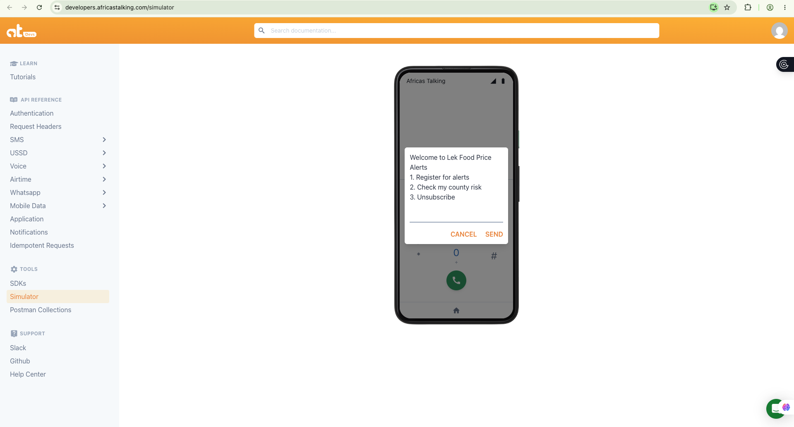

### SMS and test alert

A test alert sent from the dashboard Alerts page (or `POST /api/alerts/test`) and arriving in the Africa's Talking simulator inbox.

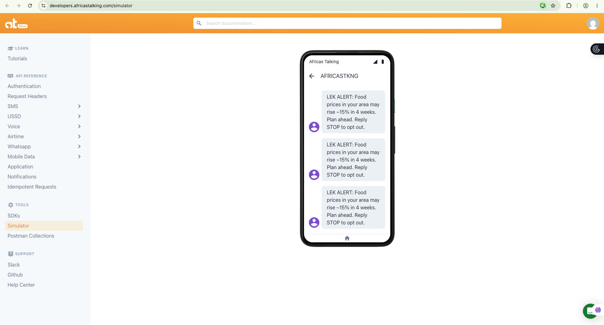

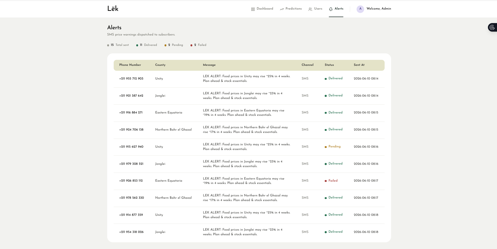

### Prediction

The dashboard Predictions view showing the national forecast and per-county figures.

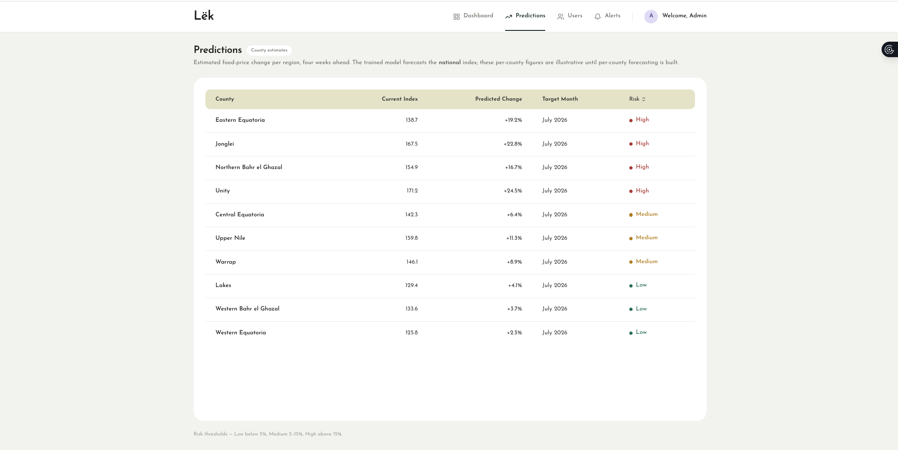

The ML service Swagger UI, used to call the model directly with different inputs.

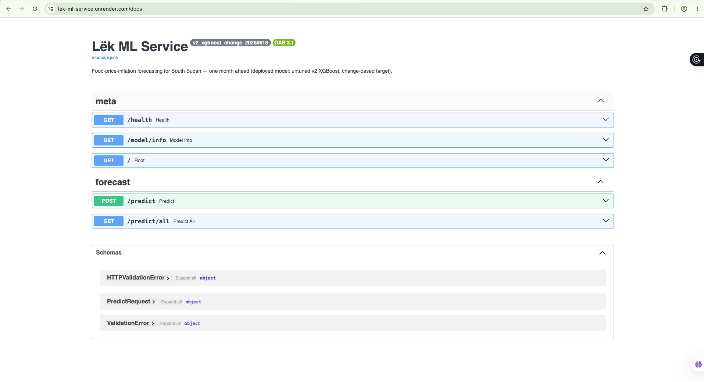

### Dashboard and RBAC

The login screen.

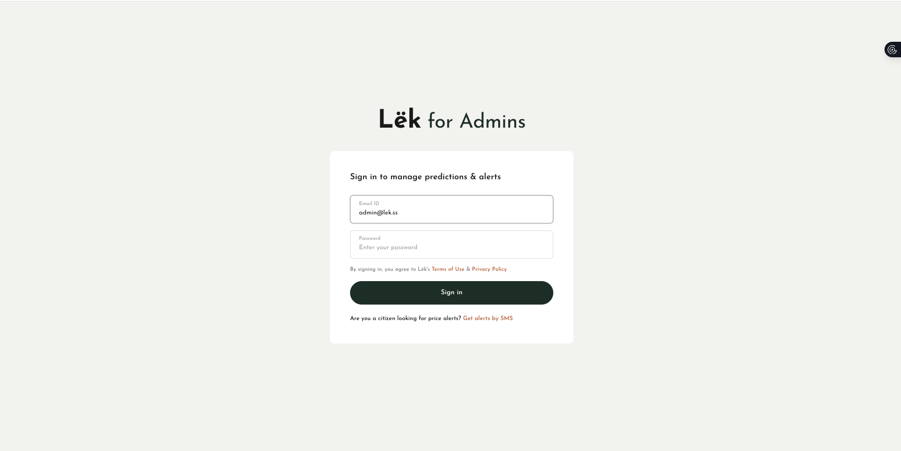

The Overview page.

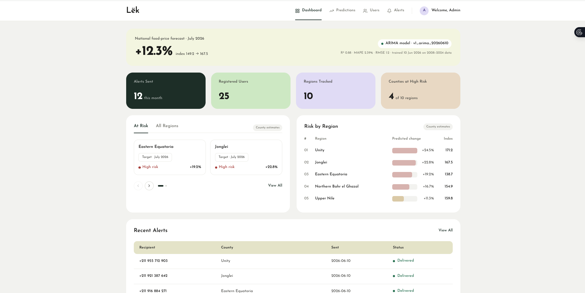

The Users page.

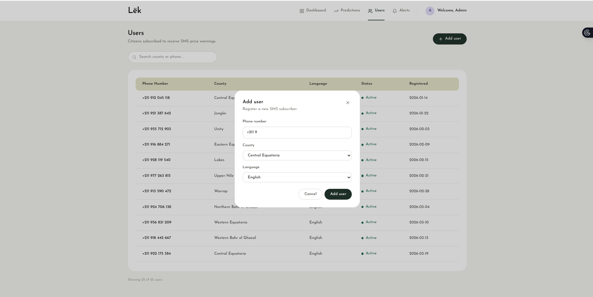

The Manage Admins page, available only to the superadmin (role-based access control).

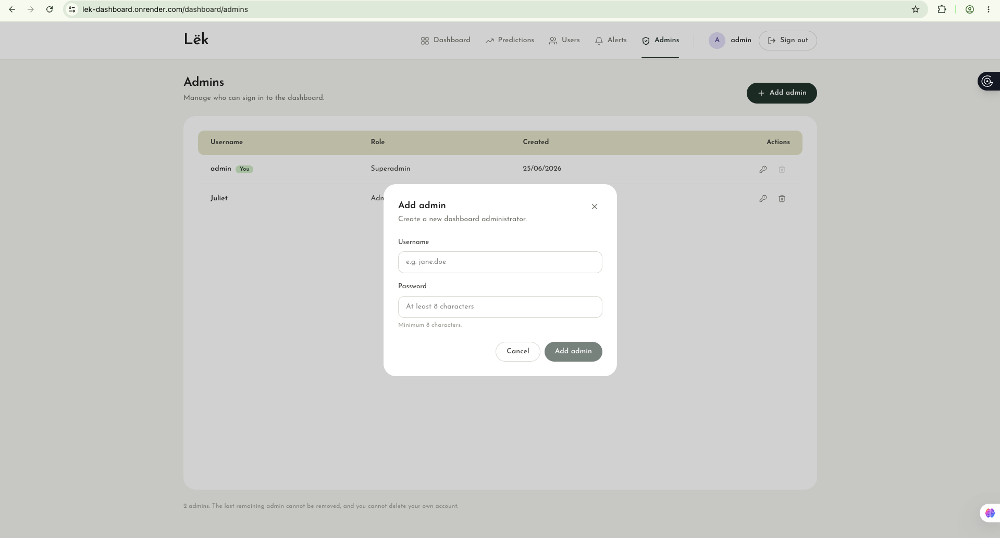

### Desktop, mobile, and deployed

The dashboard at a desktop browser width.

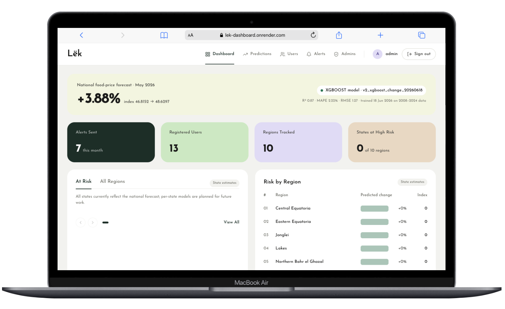

The dashboard at a mobile browser width.

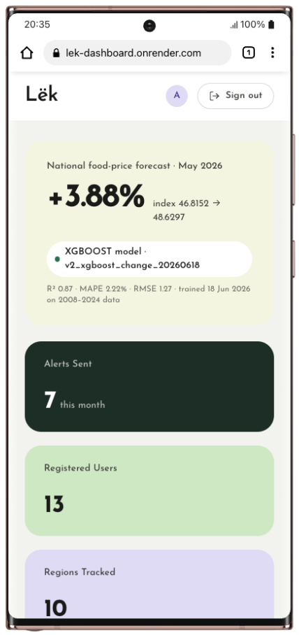

The dashboard running against the services deployed on Render.

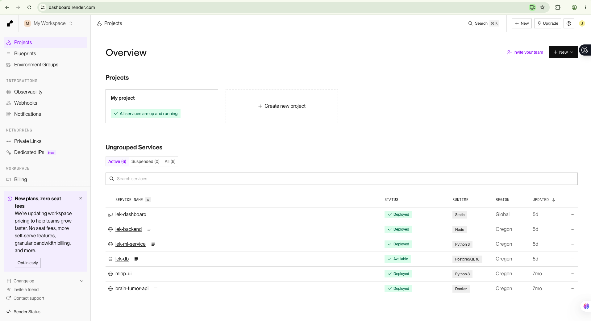

### Deployment keep-alive

The cron-job.org schedule that pings the backend health endpoint to keep the free-tier service awake.

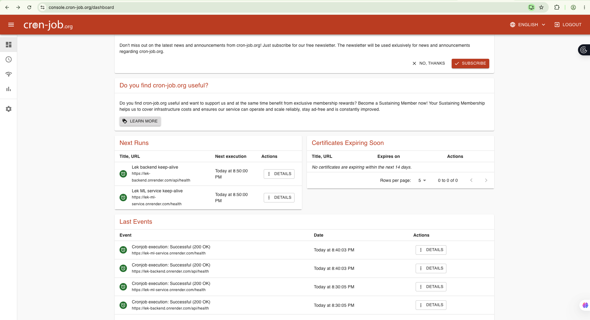

## Project structure

```
lek/
├── ml-service/        FastAPI service serving the XGBoost model
│   ├── main.py            API endpoints (/predict, /predict/all, /model/info, /health)
│   ├── predictor.py       model loading and prediction logic
│   ├── models/            model.pkl, metadata, and feature spec
│   └── requirements-serve.txt
├── backend/           Express API (auth, predictions, alerts, USSD, admin)
│   ├── src/
│   │   ├── routes/        HTTP routes (auth, predictions, alerts, ussd, admins, ...)
│   │   ├── services/      alert engine, SMS, ML client, scheduler
│   │   ├── middleware/     JWT auth and superadmin gate
│   │   └── server.js
│   └── scripts/seed.js    seeds the superadmin and demo data
├── dashboard/         React + Vite + Tailwind admin dashboard
│   └── src/
│       ├── pages/         Login, Overview, Predictions, Users, Alerts, Admins
│       └── components/
├── database/          PostgreSQL schema and seed data
│   ├── schema.sql
│   └── seed.sql
├── scripts/run-local.sh   starts all three services locally
└── docker-compose.yml
```

## Analysis

This section compares what the system set out to achieve, as defined in the
project proposal, against what was actually built and measured.

### Objective 1 — Data preparation

Met. Seven public datasets were collected and joined into a single monthly
table covering January 2007 to May 2026 across 39 South Sudanese markets:
World Bank Real-Time Food Prices (food prices), World Bank Real-Time Exchange
Rates (official and parallel rates), US EIA oil production, UCDP Georeferenced
Event Dataset (conflict events), the World Bank national Consumer Price Index,
and two hand-built tables (an oil-pipeline status timeline and a seasonal
calendar). The merged dataset met the proposal's target of under 5 percent
missing values in the key columns.

### Objective 2 — Model comparison

Met. Five models were compared: Linear Regression, ARIMA, Random Forest,
XGBoost, and LSTM. The prediction target was framed as the month-over-month
change in the food price index rather than the absolute price level, so that
the target does not drift outside the training range over time. XGBoost was
selected as the deployed model on this target (model version
`v2_xgboost_change_20260618`). On the change target, the deployed XGBoost model
reaches R-squared of 0.865 and MAPE of 2.22 percent, exceeding the proposal's
selection criteria of R-squared at or above 0.75 and MAPE at or below 15
percent.

### Objective 3 — Build, deploy, and test

Partially met. The complete system was built and deployed: a Python FastAPI ML
service, a Node.js/Express backend, a PostgreSQL database, a React dashboard,
and Africa's Talking SMS and USSD integration, all running live on Render. USSD
was confirmed working end to end against the live deployment, and the dashboard
loads prediction and alert data from the live backend. The formal pilot
described in the proposal — 20 South Sudanese testers in Kigali, with measured
SMS delivery times — was not carried out within this iteration. SMS sending is
functional and demonstrable through the alert test endpoint, but delivery
latency and structured tester feedback were not formally measured.

### Mapping to the research questions

RQ1 (can a model predict food price inflation four weeks ahead?) is answered in
the affirmative for the national month-over-month change, within the accuracy
limits above. RQ2 (which model performs best?) resulted in the selection of
XGBoost on the change target, with the metrics reported under Objective 2. RQ3
(can predictions be delivered on basic phones?) is answered in the affirmative
for USSD, which was verified live, and SMS, which is functional.

### Scope of the prediction

The deployed model produces a single national month-over-month forecast (most
recent: +3.88 percent). The dashboard presents a per-state view across South
Sudan's ten states, but those state values are derived from the single national
figure and are flagged as derived in the API; they are not independent
per-state models. This is a deliberate scoping decision given the density of
the available data, stated here so the system is not mistaken for a per-state
forecaster.

### Requirements status

| ID  | Requirement                         | Status        |
|-----|-------------------------------------|---------------|
| FR1 | Predict food price spikes           | Met           |
| FR2 | Send SMS warnings                   | Functional; auto-trigger inactive (see Discussion) |
| FR3 | Respond to USSD requests            | Met (verified live) |
| FR4 | Register and manage users           | Met           |
| FR5 | Display predictions and alert history | Met         |
| FR6 | Allow manual model updates          | Offline process; no dashboard UI |
| FR7 | Log all activity                    | Partial (USSD dials and some errors not logged) |

| ID   | Requirement      | Status                          |
|------|------------------|---------------------------------|
| NFR1 | Performance (<5s) | Not formally measured          |
| NFR2 | Accuracy targets | Met (R-squared 0.865, MAPE 2.22%) |
| NFR3 | Reliability/uptime | Not formally measured        |
| NFR4 | Scalability      | Not formally measured          |
| NFR5 | Security         | Met (env-based admin password) |
| NFR6 | SMS length (<=160) | Met                          |
| NFR7 | Maintainability  | Met (modular structure, Git)   |

## Discussion

The deployment demonstrates that the end-to-end path the proposal set out — from
a trained model, through a backend, out to a basic phone over USSD — functions
on real infrastructure. For the intended users, who mostly rely on basic phones
with no reliable internet, this delivery path is as important as the model
itself.

Framing the prediction target as month-over-month change rather than the
absolute price level was a deliberate modelling choice. On a strongly-trending,
hyperinflationary series, predicting the level directly is fragile, because the
values to be predicted keep moving beyond the range seen in training. Predicting
the change keeps the target in a stable range and makes the forecast more robust
in production.

One honest gap deserves emphasis. The system is designed to send an automatic
SMS warning when a predicted spike crosses an alert threshold. Under current
conditions the national forecast (+3.88 percent) sits below that threshold, so
the automatic alert does not fire. The SMS capability is real and can be
demonstrated through the test endpoint, but in normal operation the warning
pipeline is currently dormant. This reflects a wider point: a working forecast
and an actionable alert are not the same thing, and the alerting logic needs as
much attention as the model.

## Recommendations

For future work on this system:

- Make the alert threshold adaptive or relative, rather than a single fixed
  percentage, so that meaningful changes trigger warnings instead of only
  extreme national spikes.
- Move toward genuine per-state forecasts once sufficient market-level data
  density is available, replacing the current derived per-state values.
- Run the formal pilot from the proposal: registered testers, measured SMS
  delivery times, and structured feedback on message clarity. This would close
  the open items under Objective 3 and NFR1.
- Complete the logging coverage (FR7) by recording USSD dials and errors, and
  add a dashboard interface for model retraining (FR6) so updates do not depend
  on a manual offline process.
- Measure the unverified non-functional targets (timing, uptime, scalability)
  under realistic load.
- Plan for the data lifecycle: the underlying World Bank price feed updates on
  its own schedule, and the live database on the free hosting tier has a
  limited lifespan, so a re-seeding and retraining routine should be
  established.

For others building early-warning tools in similar settings: choose a
prediction target the model can actually represent before optimising for
accuracy, verify the delivery channel on the real devices your users own, and
report findings that contradict your hypothesis as results in their own right.
