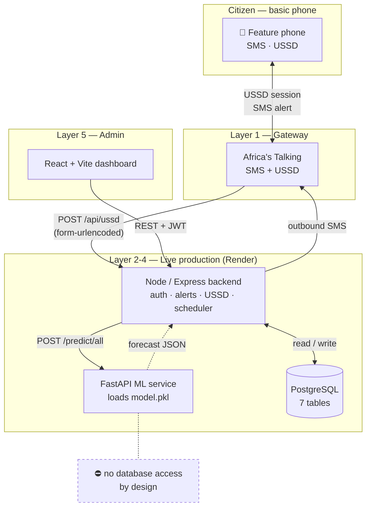

# Lëk — Food Price Early Warning for South Sudan

[](https://github.com/James-Jok-Akuei/Lek/actions/workflows/tests.yml)
[](https://nodejs.org)
[](https://www.python.org)
[](https://react.dev)
[](https://www.postgresql.org)
[](https://xgboost.readthedocs.io)
[](#license)

**Lëk** — *"to tell"* in Dinka — is a machine learning early warning system that predicts food price inflation in South Sudan four weeks ahead and delivers the warning to citizens on basic phones over SMS and USSD. A trained XGBoost model forecasts the next month's change in the national food price index; an Express backend turns that forecast into short, plain-language warnings and pushes them through the Africa's Talking gateway to registered subscribers, who can also dial a USSD code to check their own state's risk on a handset with no internet connection at all. An admin dashboard sits on top for monitoring predictions, subscribers, and the alert log. Lëk was built as a BSc Software Engineering capstone project at **African Leadership University**.

## Live links

| Resource | URL |
|---|---|
| Admin dashboard | https://lek-dashboard.onrender.com |
| Backend API | https://lek-backend.onrender.com |
| ML service (Swagger UI) | https://lek-ml-service.onrender.com/docs |
| Demo video | [Google Drive](https://drive.google.com/file/d/1HTU4Tg78og37Z3i6tSdGC0Q9CBSlXnxa/view?usp=sharing) |
| USSD (Africa's Talking sandbox) | `*384*9509#` |

> All services run on Render's free tier. An idle service spins down, so the **first** request after a quiet period can take up to ~50 seconds while it wakes. Subsequent requests are fast.

---

## Table of contents

- [The problem](#the-problem)
- [Key results](#key-results)
- [Architecture](#architecture)
- [Tech stack](#tech-stack)
- [Repository structure](#repository-structure)
- [Getting started](#getting-started)
- [Environment variables](#environment-variables)
- [API reference](#api-reference)
- [Database schema](#database-schema)
- [Machine learning pipeline](#machine-learning-pipeline)
- [Testing](#testing)
- [Deployment](#deployment)
- [Limitations and roadmap](#limitations-and-roadmap)
- [Author and license](#author-and-license)

---

## The problem

Food price information in South Sudan reaches the people who need it last. Official price bulletins are published weeks after the prices they describe, in English, on the web — in a country where **84.3% of citizens have no reliable internet access**. By the time a household learns that sorghum has moved, it has already moved.

Lëk addresses both halves of that failure. It **predicts** rather than reports, forecasting the food price index four weeks ahead so a warning arrives before the price does. And it **delivers on the hardware people actually own**: a 160-character SMS, or a USSD session on a feature phone with no data plan, no app store, and no smartphone.

## Key results

| Metric | Deployed model (XGBoost) |
|---|---|
| R² | **0.865** |
| MAPE | **2.22%** |
| RMSE | 1.272 |
| Improvement in RMSE over Linear Regression baseline | **97.5%** (50.311 → 1.272) |
| Model version | `v2_xgboost_change_20260618` |

- **Chronological hold-out, not a random split.** The model trains on data through **December 2024** and is evaluated on the period after it, so no future information leaks backwards into training. This is the honest evaluation for a forecasting task.
- **Five models compared** — Linear Regression, ARIMA, Random Forest, XGBoost, and LSTM — on identical data and the identical target. Full per-model metrics are stored in [`lek/ml-service/models/model_metadata.json`](lek/ml-service/models/model_metadata.json) and served live from `GET /model/info`.
- **XGBoost was deployed over the narrow RMSE winner.** ARIMA edges XGBoost on RMSE (1.197 vs 1.272) but is univariate — it ignores the conflict, oil, and exchange-rate datasets that this project exists to exploit. XGBoost is the strongest *multivariate* model and beats ARIMA on MAPE (2.22% vs 2.39%), so ARIMA is retained as the documented baseline rather than deployed.
- **Field testing completed:** the system was tested with **25 South Sudanese participants in Kigali**, and **24 of 25** confirmed the warning messages were clear and understandable — validating the delivery channel, not just the model.

Manual test evidence — USSD sessions, delivered SMS, dashboard views, RBAC, and responsive layouts — is captured as screenshots in [`lek/docs/screenshots/`](lek/docs/screenshots/).

## Architecture

Lëk runs in **two zones** that never share a process:

1. **Live production (Render)** — the four always-on services that serve users: ML service, backend, PostgreSQL, and dashboard.
2. **Offline training (Google Colab)** — a monthly, human-run notebook that rebuilds the dataset, retrains and compares the models, and emits a new `model.pkl`. Nothing in the live zone can trigger training; a new model reaches production only by being committed to the repository and redeployed.

The live zone is five layers:


```mermaid
flowchart TD
    subgraph citizen["Citizen — basic phone"]
        P["📱 Feature phone<br/>SMS · USSD"]
    end

    subgraph gateway["Layer 1 — Gateway"]
        AT["Africa's Talking<br/>SMS + USSD"]
    end

    subgraph app["Layer 2-4 — Live production (Render)"]
        BE["Node / Express backend<br/>auth · alerts · USSD · scheduler"]
        ML["FastAPI ML service<br/>loads model.pkl"]
        DB[("PostgreSQL<br/>7 tables")]
    end

    subgraph admin["Layer 5 — Admin"]
        DASH["React + Vite dashboard"]
    end

    P <-->|"USSD session<br/>SMS alert"| AT
    AT -->|"POST /api/ussd<br/>(form-urlencoded)"| BE
    BE -->|"outbound SMS"| AT
    DASH -->|"REST + JWT"| BE
    BE -->|"POST /predict/all"| ML
    ML -.->|"forecast JSON"| BE
    BE <-->|"read / write"| DB
    ML -.- NODB["⛔ no database access<br/>by design"]

    style NODB stroke-dasharray: 4 4
```

Plain-text equivalent of the request flow:

```
  Citizen's basic phone
          │  dials *384*9509#  /  receives SMS
          ▼
  ┌─────────────────────┐
  │  Africa's Talking   │   Layer 1 — gateway
  │     SMS / USSD      │
  └──────────┬──────────┘
             │  POST /api/ussd (form-urlencoded, public)
             │  ▲ outbound SMS alerts
             ▼  │
  ┌───────────────┐    ┌───────────────┐    ┌───────────────┐
  │   Dashboard   │───▶│    Backend    │───▶│  ML service   │
  │ React + Vite  │    │ Express + JWT │    │ FastAPI + XGB │
  │   (Layer 5)   │◀───│   (Layer 2)   │◀───│   (Layer 3)   │
  └───────────────┘    └───────┬───────┘    └───────────────┘
                               │                    ✗ no DB
                               ▼
                        ┌───────────────┐
                        │  PostgreSQL   │   Layer 4
                        │   7 tables    │
                        └───────────────┘
```

**The ML service has no database access, by design.** It is a pure function: it loads `model.pkl` and its feature spec at startup and answers prediction requests from local artifacts only. It holds no connection string and issues no queries. **The backend owns all persistence** — it calls the ML service, then writes the resulting predictions, alerts, and model-version rows to PostgreSQL itself. This keeps the model server stateless and independently redeployable, and means a compromised or crashed ML service cannot corrupt application data.

The dashboard is a thin client: it talks only to the backend and holds no business logic.

Forecasts from the model are **national**. The per-state figures shown in the dashboard and over USSD are *derived* from that single national prediction and are flagged as derived in the API — they are not ten independent per-state models.

## Tech stack

| Service | Language | Framework | Key libraries |
|---|---|---|---|
| **ML service** | Python 3.12 | FastAPI + Uvicorn | `xgboost==3.2.0`, `scikit-learn`, `statsmodels`, `pandas`, `numpy`, `joblib`, `pydantic` |
| **Backend** | Node.js 18+ (CommonJS) | Express 4 | `pg`, `jsonwebtoken`, `bcrypt`, `africastalking`, `node-cron`, `cors`, `dotenv` |
| **Dashboard** | JavaScript (ESM) | React 19 + Vite 8 | `react-router-dom` 7, `recharts` 3, `tailwindcss` 4, `lucide-react` |
| **Database** | SQL | PostgreSQL 16 | — |
| **Training** | Python 3.12 | Jupyter / Colab | `tensorflow` (LSTM), `statsmodels` (ARIMA), `scikit-learn`, `xgboost` |
| **Messaging** | — | Africa's Talking | SMS + USSD |
| **CI / hosting** | — | GitHub Actions, Render | `render.yaml` blueprint |

The ML service ships **two dependency files**: [`requirements.txt`](lek/ml-service/requirements.txt) is the full training + inference stack (includes TensorFlow), and [`requirements-serve.txt`](lek/ml-service/requirements-serve.txt) is runtime-only — no TensorFlow — so the deployed image fits comfortably inside Render's free-tier 512 MB. Production and CI both install the serve file.

## Repository structure

The application lives inside the `lek/` subfolder; the blueprint and CI config sit at the repository root.

```
Lek/
├── README.md                     this file
├── DEPLOY.md                     full step-by-step Render deployment guide
├── render.yaml                   Render Blueprint — 4 free-tier resources
├── .github/workflows/tests.yml   CI: Jest + pytest on every push and PR
└── lek/
    ├── docker-compose.yml        full local stack in one command
    ├── .env.example              every backend/ML variable, documented
    │
    ├── ml-service/               FastAPI service serving the XGBoost model
    │   ├── main.py                   API endpoints and CORS
    │   ├── predictor.py              model loading + prediction logic (single source of truth)
    │   ├── models/                   model.pkl, metadata, feature_spec, backtest, history
    │   ├── build_production_model.py  rebuilds model.pkl from the training output
    │   ├── build_backtest.py         regenerates backtest.json
    │   ├── test_prediction.py        standalone demo script (excluded from pytest)
    │   └── tests/                    pytest suite (API + predictor)
    │
    ├── backend/                  Express API — the system hub
    │   ├── src/
    │   │   ├── app.js                Express app: routes + middleware (no listener)
    │   │   ├── server.js             entry point: DB check, listen, start scheduler
    │   │   ├── config.js             all env vars read here, in one place
    │   │   ├── i18n.js               English + Arabic strings for USSD and SMS
    │   │   ├── db/pool.js            shared PostgreSQL pool (SSL toggle)
    │   │   ├── middleware/auth.js    requireAuth (JWT) + requireSuperadmin (RBAC)
    │   │   ├── routes/               auth, ussd, predictions, alerts, users, admins, …
    │   │   └── services/             alertEngine, smsService, mlService, predictionService, scheduler
    │   ├── scripts/seed.js       idempotent seed: superadmin, subscribers, thresholds
    │   └── tests/                Jest suite (7 files)
    │
    ├── dashboard/                React + Vite + Tailwind admin dashboard
    │   └── src/
    │       ├── pages/                Login, Overview, Predictions, ModelPerformance,
    │       │                         Users, Alerts, Admins, PrivacyPolicy, TermsOfUse
    │       ├── components/           DashboardLayout, TopNav, Footer, Badge, Logo
    │       └── api.js                single fetch wrapper (reads VITE_API_URL)
    │
    ├── database/
    │   ├── schema.sql            7 tables + 10 indexes
    │   └── seed.sql              the 10 states of South Sudan
    │
    ├── training/
    │   ├── train_model.ipynb     the offline pipeline: merge → engineer → compare → export
    │   └── data/
    │       ├── raw/                  the downloaded public datasets
    │       ├── manual/               hand-built pipeline status + seasonal calendar
    │       └── processed/            master_monthly.csv — the merged national table
    │
    ├── scripts/run-local.sh      starts all three services locally (no Docker)
    └── docs/
        ├── DEPLOYMENT.md
        ├── screenshots/          manual test evidence
        └── report-figures/
```

## Getting started

### Prerequisites

- Node.js 18 or newer
- Python 3.12
- PostgreSQL 14 or newer *(not needed for the Docker path)*
- Docker and Docker Compose *(only for path A)*

```bash
git clone https://github.com/James-Jok-Akuei/Lek.git
cd Lek/lek
```

---

### Path A — Docker Compose (quick start)

One command brings up Postgres, the ML service, the backend, and the dashboard:

```bash
cd lek
docker compose up --build
```

| Service | URL |
|---|---|
| Dashboard | http://localhost:8080 |
| Backend API | http://localhost:3000 |
| ML service (Swagger) | http://localhost:8000/docs |
| PostgreSQL | `localhost:5432` (db/user/password: `lek`) |

**How the database initialises.** The `db` service mounts the two SQL files into the Postgres image's init directory:

```yaml
volumes:
  - ./database/schema.sql:/docker-entrypoint-initdb.d/01-schema.sql:ro
  - ./database/seed.sql:/docker-entrypoint-initdb.d/02-seed.sql:ro
```

The official Postgres image runs everything in `/docker-entrypoint-initdb.d` **in filename order, and only when the data volume is empty** — i.e. on first init. The numeric prefixes guarantee `schema.sql` (tables) runs before `seed.sql` (the 10 states). On any later `docker compose up` the volume already has data, so the scripts are skipped entirely.

**How the application data is seeded.** The backend service overrides its image command:

```yaml
command: sh -c "node scripts/seed.js && node src/server.js"
```

`seed.js` runs first — creating the superadmin, ~50 demo subscribers, and per-state alert thresholds — and only then does the API start. Because `seed.js` is idempotent, this is safe on every restart.

> **Getting the admin password on the Docker path.** `docker-compose.yml` does **not** set `ADMIN_INITIAL_PASSWORD`, and the backend container does not receive the repo-root `.env` (the build context is `./backend`). So on first run `seed.js` **generates a strong random password and prints it once** to the backend logs:
>
> ```bash
> docker compose logs backend | grep -A2 password
> ```
>
> To choose your own password instead, add it to the `backend` service's `environment:` block before the first run, or re-run the seed afterwards:
>
> ```bash
> docker compose exec -e ADMIN_INITIAL_PASSWORD='your-strong-password' backend node scripts/seed.js
> ```
>
> Sign in at http://localhost:8080 with username `admin`.

To start over completely (drops the database volume so the init scripts re-run):

```bash
docker compose down -v && docker compose up --build
```

---

### Path B — Manual setup (required for Render or any fresh cloud database)

Use this path for local development without Docker, and **necessarily** for any managed database — Render, Neon, Supabase and the like give you an empty database with no `/docker-entrypoint-initdb.d` hook, so nothing initialises itself. You must run the three steps below by hand, **in this exact order**.

```bash
# 1. Tables and indexes — 7 tables, 10 indexes.
psql "$DATABASE_URL" -f database/schema.sql

# 2. Reference data — the 10 states. MUST run before seed.js.
psql "$DATABASE_URL" -f database/seed.sql

# 3. Application data — superadmin, demo subscribers, per-state thresholds.
cd backend && DATABASE_URL="postgresql://..." \
              DATABASE_SSL=true \
              ADMIN_INITIAL_PASSWORD='your-strong-password' \
              node scripts/seed.js
```

**Why the order matters — this is not arbitrary:**

| Step | Depends on | What happens if you skip ahead |
|---|---|---|
| `schema.sql` | nothing | Every later step fails: the tables don't exist. |
| `seed.sql` | `schema.sql` | `INSERT INTO counties` fails — no such table. |
| `seed.js` | `seed.sql` | **Silent partial failure.** `seed.js` looks each subscriber's state up by name and does `if (!cid) continue;`. With an empty `counties` table every lookup misses, so you get an admin account but **zero subscribers and zero thresholds**, with no error. |

**Two properties of these scripts worth knowing:**

- **`schema.sql` is not re-runnable.** It uses bare `CREATE TABLE`, not `CREATE TABLE IF NOT EXISTS`, so running it against a database that already has the tables aborts with `relation "counties" already exists`. This is deliberate — it fails loudly rather than silently half-applying — but it means you only ever run it against an empty database.
- **`seed.js` *is* idempotent**, and doubles as the admin password-reset path. Subscribers insert with `ON CONFLICT (phone_number) DO NOTHING`; thresholds are checked before insert; and if the `admin` row already exists, its password is updated from `ADMIN_INITIAL_PASSWORD` while its role is left untouched. Re-run it any time you need to recover access:

  ```bash
  cd backend && DATABASE_URL="..." DATABASE_SSL=true \
                ADMIN_INITIAL_PASSWORD='new-password' node scripts/seed.js
  ```

  Leave `ADMIN_INITIAL_PASSWORD` unset and it generates a strong random password, printing it **once**. To promote an existing non-superadmin `admin` row, re-run with `PROMOTE_TO_SUPERADMIN=true` — the script never changes a role silently.

#### Then start the three services

```bash
# ML service — port 8000
cd ml-service
python3.12 -m venv .venv
./.venv/bin/pip install -r requirements-serve.txt
./.venv/bin/uvicorn main:app --port 8000        # Swagger at /docs

# Backend — port 3000
cd backend
npm install
cp ../.env.example ../.env                       # then edit ../.env
npm run dev

# Dashboard — port 5173
cd dashboard
npm install
npm run dev
```

Once the one-time setup is done, all three can be started together from the `lek/` folder:

```bash
./scripts/run-local.sh
```

Open http://localhost:5173 and sign in as `admin`.

## Environment variables

Backend and ML service variables are loaded from a **single `.env` at the `lek/` folder root** (`backend/src/config.js` resolves `../../.env`). Copy [`lek/.env.example`](lek/.env.example) to `.env` to start. The dashboard reads its own build-time variable from `lek/dashboard/.env`.

> **Never commit real values.** Everything below uses placeholders. In `render.yaml` all secrets are marked `sync: false`, so Render prompts for them in its dashboard rather than reading them from the repository.

| Variable | Service | Required | Default | Purpose |
|---|---|---|---|---|
| `DATABASE_URL` | backend | **Yes** | — | PostgreSQL connection string. On Render this is wired automatically from the `lek-db` resource. |
| `DATABASE_SSL` | backend | Cloud only | `false` | Must be the **exact string `"true"`** to enable SSL (`config.js` tests `=== 'true'`). Required when reaching a managed Postgres over its *external* URL; leave unset for local Postgres, which has no SSL. |
| `ADMIN_INITIAL_PASSWORD` | backend (`seed.js`) | Recommended | — | Password for the initial `admin` superadmin. If unset, `seed.js` generates a strong random one and prints it **once**. Also the password-reset lever on re-run. |
| `PROMOTE_TO_SUPERADMIN` | backend (`seed.js`) | No | `false` | Set to `"true"` to promote an existing `admin` row to `superadmin`. Opt-in only — roles are never changed silently. |
| `JWT_SECRET` | backend | **Yes** (production) | `dev-secret` | Signing secret for admin session tokens. The insecure default exists so local dev works out of the box — **always override in production**. |
| `ML_SERVICE_URL` | backend | No | `http://localhost:8000` | Base URL of the FastAPI ML service. |
| `ALLOWED_ORIGINS` | backend, ML service | No | `http://localhost:5173,http://127.0.0.1:5173` | Comma-separated browser origins permitted by CORS. Set to the deployed dashboard URL in production. |
| `PORT` | backend | No | `3000` | Port the Express server binds to. Render injects this. |
| `NODE_ENV` | backend | No | `development` | Standard Node environment flag. |
| `SCHEDULER_ENABLED` | backend | No | `false` | Must be `"true"` to run the monthly predict-then-alert cron (1st of month, 06:00). Off by default so it never fires during local dev or tests — trigger manually via `POST /api/scheduler/run-now`. |
| `AFRICAS_TALKING_USERNAME` | backend | No | `sandbox` | Africa's Talking account username. `sandbox` for the simulator. |
| `AFRICAS_TALKING_API_KEY` | backend | No | *(empty)* | Africa's Talking API key. **If empty the SMS service runs in simulated mode**, logging messages instead of sending them, so the pipeline works end to end with no credentials. Never logged. |
| `AFRICAS_TALKING_SHORTCODE` | backend | No | *(empty)* | Sender ID / shortcode for outbound SMS. |
| `VITE_API_URL` | dashboard | No | `http://localhost:3000/api` | Backend API base URL. **Baked in at build time** — changing it requires a rebuild, not a restart. |
| `PYTHON_VERSION` | ML service (Render) | No | `3.12.7` | Pins the Python runtime on Render. |

## API reference

### Backend — Node / Express

All routes are prefixed `/api`. Everything except the three public routes requires an `Authorization: Bearer <JWT>` header, applied globally by `requireAuth` in [`app.js`](lek/backend/src/app.js).

| Method | Endpoint | Auth | Purpose |
|---|---|---|---|
| `GET` | `/api/health` | Public | Backend status plus reachability of the database and ML service. Returns `503` if the DB is down. |
| `POST` | `/api/auth/login` | Public | Admin login → JWT. |
| `POST` | `/api/ussd` | Public | Africa's Talking USSD callback (form-urlencoded). Responds `CON …` to continue or `END …` to terminate. |
| `GET` | `/api/model` | JWT | Deployed model metadata (proxied from the ML service). |
| `GET` | `/api/forecast` | JWT | National forecast (legacy compatibility route). |
| `GET` | `/api/model-versions` | JWT | Every row in `model_versions`, oldest first. |
| `GET` | `/api/model-performance` | JWT | Feature importances + held-out backtest series, proxied from the ML service. |
| `GET` | `/api/counties` | JWT | The 10 states with their latest prediction and derived risk level. |
| `POST` | `/api/predictions/run` | JWT | Pull `/predict/all` from the ML service and persist the rows. |
| `GET` | `/api/predictions` | JWT | The most recent prediction run, joined with state names. |
| `GET` | `/api/predictions/latest` | JWT | The most recent prediction per state. |
| `GET` | `/api/predictions/activity` | JWT | Predicted change per `prediction_date`, oldest first (dashboard chart). |
| `GET` | `/api/alerts` | JWT | Recent alert log. |
| `POST` | `/api/alerts/run` | JWT | Run the alert engine against the latest stored predictions. |
| `POST` | `/api/alerts/test` | JWT | Send one sample warning SMS to a given number (demo/pilot). |
| `POST` | `/api/alerts/broadcast` | JWT | Send a custom message to all subscribers, optionally filtered to one state. |
| `GET` | `/api/users` | JWT | List SMS subscribers (optional `?county=Name`). |
| `GET` | `/api/users/:id` | JWT | One subscriber. |
| `POST` | `/api/users` | JWT | Register a subscriber. `POST /api/users/register` is a backward-compatible alias. |
| `PATCH` | `/api/users/:id` | JWT | Update state, status, or language preference. |
| `DELETE` | `/api/users/:id` | JWT | Remove a subscriber. |
| `GET` | `/api/admins` | **Superadmin** | List admin accounts (never returns `password_hash`). |
| `POST` | `/api/admins` | **Superadmin** | Create an admin — always with role `admin`, never `superadmin`. |
| `PATCH` | `/api/admins/:id/password` | **Superadmin** | Change an admin's password. |
| `DELETE` | `/api/admins/:id` | **Superadmin** | Delete an admin. Blocks deleting the superadmin, yourself, or the last admin. |
| `GET` | `/api/stats` | JWT | Summary tiles for the dashboard Overview. |
| `GET` | `/api/dashboard/summary` | JWT | Aggregated overview statistics. |
| `POST` | `/api/scheduler/run-now` | JWT | Trigger the monthly predict-then-alert cycle immediately — the same job the cron runs. |

**Role-based access control.** `requireSuperadmin` gates the entire `/api/admins` router and runs after `requireAuth`. New accounts are always created with the `admin` role; the superadmin cannot be created, promoted to, or deleted through the API.

### ML service — Python / FastAPI

No authentication (the service is internal, and holds no data) and **no database access**.

| Method | Endpoint | Purpose |
|---|---|---|
| `GET` | `/` | Service banner: name, docs path, model version, load status. |
| `GET` | `/health` | Service + model status. Reports `model_loaded: false` with the reason if the artifact failed to load. Used as Render's health check. |
| `POST` | `/predict` | Body `{"county": "…"}` (optional). Omit `county` for the national forecast; supply one for the derived per-state figure. |
| `GET` | `/predict/all` | Forecast for all 10 states. Per-state figures are flagged as derived. |
| `GET` | `/model/info` | Deployed-model metadata: version, metrics, training range, selection rationale, staleness caveat. |
| `GET` | `/model/performance` | Offline evaluation detail — feature importances from `model.pkl` plus the held-out backtest series. Anything genuinely unavailable returns `null` rather than a substituted value. |

Interactive Swagger UI at `/docs`.

## Database schema

Seven tables, defined in [`lek/database/schema.sql`](lek/database/schema.sql) with 10 supporting indexes on foreign keys and frequently queried columns.

| # | Table | Purpose |
|---|---|---|
| 1 | `counties` | The 10 states of South Sudan, with each one's lean-season start and end month. |
| 2 | `users` | SMS subscribers: phone number (unique), home state, language preference, status, registration timestamp. |
| 3 | `admin_users` | Dashboard accounts: username, bcrypt password hash, role (`admin` / `superadmin`). |
| 4 | `model_versions` | One row per trained model: version name, training timestamp, RMSE / MAPE / R², and which is active. |
| 5 | `predictions` | Every forecast produced: predicted price, predicted change %, the date it was made, and the month it targets. |
| 6 | `alerts` | Every warning dispatched: message text, channel, delivery status, timestamp. |
| 7 | `thresholds` | Per-state danger and severe alert levels, with the admin who last changed them. |

### Traceability by design

The foreign keys are the point, not an afterthought — every warning that reaches a citizen can be traced back to the exact model that caused it:

```
model_versions ──< predictions ──< alerts >── users
                                    │
        "which model said so"  ◀────┴────▶  "who was told"
```

- **Every alert links to both the user and the prediction** (`alerts.user_id`, `alerts.prediction_id`) — so for any message sent you can recover who received it and precisely which forecast triggered it.
- **Every prediction links to the model version that produced it** (`predictions.model_version_id`) — so a forecast can always be attributed to a specific trained artifact with known offline metrics.

Chained together, any alert resolves to `alert → prediction → model_version`. If a model is later found to be faulty, every warning it caused can be identified. For an early warning system that asks people to act on its output, that audit trail is a requirement, not a nicety.

## Machine learning pipeline

The pipeline is an **offline, monthly, human-run process** in [`lek/training/train_model.ipynb`](lek/training/train_model.ipynb) (Google Colab). It merges the raw data, engineers features, trains and compares the five candidate models, and exports the winner as `model.pkl` for the FastAPI service to load.

### Data sources — 7 public datasets

| # | Dataset | Provides |
|---|---|---|
| 1 | **World Bank RTFP** (Real-Time Food Prices) | Market-level food price index and 14 commodity prices across 40 markets |
| 2 | **World Bank RTFX** (Real-Time Exchange Rates) | Official and parallel-market SSP exchange rates |
| 3 | **US EIA** | South Sudan monthly oil production |
| 4 | **UCDP GED** (Georeferenced Event Dataset) | Conflict events and fatalities, South Sudan and Sudan |
| 5 | **World Bank CPI** | National Consumer Price Index |
| 6 | **Pipeline status timeline** *(hand-built)* | Whether the oil export pipeline was flowing each month |
| 7 | **FEWS NET seasonal calendar** *(hand-built)* | Lean-season months and season labels |

These are merged onto a monthly spine into a single national table, [`training/data/processed/master_monthly.csv`](lek/training/data/processed/master_monthly.csv) — **232 monthly rows, January 2007 to April 2026**. Market-level rows are aggregated to national figures by taking the **mean across markets per month**, not a raw average of all rows.

### Feature engineering — 47 features

Commodity closes and the food price index; exchange rate; oil production; national CPI; pipeline status; lean-season flag and season ordinal; lagged food-price features (1, 3, 6, 12 months) and rolling means (3, 6); lagged exchange rate (1, 3), oil (1), and conflict events and deaths for both countries (1); and 12 month-of-year dummies.

### The key design decision — predict the change, not the level

**Version 1 predicted the price level directly, and it failed.** On a hyperinflationary series the values to be predicted keep moving above anything seen in training, and neither tree ensembles nor neural networks can extrapolate beyond their training range — a tree's prediction is bounded by its leaf values, so it flat-lines at the top of the training data exactly when the price is running away. The measured damage:

| Model (v1 — predicting the **level**) | RMSE | MAPE | R² |
|---|---|---|---|
| XGBoost | 33.499 | **79.94%** | −92.685 |
| Random Forest | 14.292 | 32.39% | −16.053 |
| LSTM | 40.141 | 96.16% | −133.517 |
| Linear Regression | 10.042 | 21.37% | −7.419 |
| ARIMA *(differencing makes it immune)* | 1.197 | 2.39% | 0.880 |

The negative R² values are the tell: these models performed worse than simply predicting the mean. Only ARIMA survived, because its integration term already differences the series.

**Version 2 changed the target to the monthly log-change** and reconstructed the level afterwards:

```
target:          y = ln(index[t+1]) − ln(index[t])
reconstruction:  predicted_level = last_known_index × exp(prediction)
```

This keeps the target in a stable, stationary range that stays inside what the model saw during training, no matter how far the underlying index climbs. The result:

| XGBoost | RMSE | MAPE | R² |
|---|---|---|---|
| v1 — predicting the level | 33.499 | **79.94%** | −92.685 |
| v2 — predicting the log-change | **1.272** | **2.22%** | **0.865** |

**MAPE fell from 79.9% to 2.22%** — a usable forecast from an unusable one, achieved by reframing the target rather than by tuning the model. A subsequent tuning pass (Optuna plus six extra features) *regressed* performance to MAPE 3.08% and was not deployed; the untuned v2 model is what ships.

### Known data caveat

Conflict (UCDP) and national CPI data end in 2024, and oil production ends January 2026. These features are forward-filled across 2025–2026, and the API forward-fills them at request time per [`feature_spec.json`](lek/ml-service/models/feature_spec.json). This is documented in the model metadata and surfaced through `GET /model/info` rather than hidden.

## Testing

Both suites run with **no services up** and **no credentials**: the backend tests mock the database and the SMS provider, and the ML tests load the real committed model artifact — so they also fail loudly if `model.pkl` is missing or broken.

```bash
# Backend — Jest + Supertest
cd lek/backend && npm test

# ML service — pytest + FastAPI TestClient
cd lek/ml-service && ./.venv/bin/python -m pytest
```

**Current status — verified by running both suites:**

| Suite | Runner | Tests | Result |
|---|---|---|---|
| Backend | Jest 30 | **65** across 7 files | ✅ all passing |
| ML service | pytest | **19** | ✅ all passing |

**Backend coverage** (`lek/backend/tests/`): JWT auth middleware and the superadmin RBAC gate; alert-engine threshold logic; the SMS service including simulated mode; the login route; JWT protection of the protected routes; the USSD routing flow; and the i18n string table — including an assertion that the Arabic warning fits one UCS-2 SMS segment (70 characters) for all ten state names.

**ML service coverage** (`lek/ml-service/tests/`): model loading, prediction sanity and level reconstruction, derived per-state flags, `/health`, `/predict` request validation, `/predict/all`, and `/model/info`. `pytest.ini` restricts collection to `tests/` so the standalone demo script `test_prediction.py` is not picked up by its filename.

### Continuous integration

[`.github/workflows/tests.yml`](.github/workflows/tests.yml) runs **both suites on every push and every pull request**, as two parallel jobs:

- **backend (Jest)** — Node 24, `npm ci`, `npm test`, with npm caching keyed to `lek/backend/package-lock.json`.
- **ml-service (pytest)** — Python 3.12, installs `requirements-serve.txt` (the same dependency set the deployed service uses) plus `pytest` and `httpx`, then `python -m pytest`.

Testing the ML service against the *serve* requirements rather than the full training stack means CI verifies the exact dependency set that runs in production.

### Manual test evidence

Screenshots of the tested flows — USSD registration and risk lookup in the Africa's Talking simulator, delivered test SMS, the dashboard's Overview / Predictions / Users / Alerts pages, superadmin-only RBAC, desktop and mobile layouts, and the deployed system — are in [`lek/docs/screenshots/`](lek/docs/screenshots/).

## Deployment

Deployed on **Render** via the [`render.yaml`](render.yaml) blueprint at the repository root. Because the application lives in the `lek/` subfolder, each service sets `rootDir: lek/...`. Full step-by-step instructions are in [`DEPLOY.md`](DEPLOY.md).

| Resource | Type | Role |
|---|---|---|
| `lek-db` | PostgreSQL (free) | Application database. `DATABASE_URL` is wired into the backend automatically via `fromDatabase`. |
| `lek-ml-service` | Web (Python, free) | FastAPI + XGBoost. Builds from `requirements-serve.txt` (no TensorFlow, to fit the 512 MB tier). Health check `/health`. |
| `lek-backend` | Web (Node, free) | Express API. Health check `/api/health`. Runs the monthly scheduler with `SCHEDULER_ENABLED=true`. |
| `lek-dashboard` | Static site (free) | Vite build published from `dist`, with an SPA rewrite so client-side routes resolve to `index.html`. |

All secrets (`JWT_SECRET`, the Africa's Talking credentials, `ADMIN_INITIAL_PASSWORD`, the cross-service URLs) are declared `sync: false` — Render prompts for them in its dashboard and never reads them from this repository. **No live credentials or connection strings appear anywhere in this repo.**

### Free-tier constraints

Two limits materially affect anyone running this deployment, including a marker opening the live links:

1. **Web services sleep after 15 minutes of inactivity.** The first request after a quiet period takes up to ~50 seconds while the service wakes. A scheduled ping from cron-job.org hits the backend health endpoint to keep it warm; the schedule is evidenced in `lek/docs/screenshots/cron-keepalive.png`.
2. **Free PostgreSQL instances expire after 90 days.** When the database expires, a new one must be provisioned — and it arrives **empty**, with no auto-initialisation. Recovery is exactly the three ordered steps in [Path B](#path-b--manual-setup-required-for-render-or-any-fresh-cloud-database): `schema.sql`, then `seed.sql`, then `seed.js` with `DATABASE_SSL=true`. This is the single most likely reason for a live link to look broken, and the reason Path B is documented as carefully as it is.

## Limitations and roadmap

### Limitations

These are stated plainly because they bound what the results mean.

- **User testing was completed in Kigali rather than inside South Sudan.** All 25 participants were South Sudanese and 24 of 25 confirmed the messages were clear, but the sessions ran in Rwanda, on Rwandan networks, through the Africa's Talking sandbox. Message comprehension is therefore validated; in-country network conditions, handset diversity, and live delivery latency are the next thing to measure.
- **Warnings are English and Arabic only.** The USSD menus and alert SMS support both, with the language chosen on a subscriber's first call and stored on their record. **Dinka and Nuer are not yet supported** — and the system is named in Dinka, which makes the gap conspicuous.
- **Forecasts are national, monthly, and presented at state level.** The model produces one national month-ahead figure; the ten state-level values shown in the dashboard and over USSD are *derived* from it, not independent per-state models. The API flags them as derived. Granularity is monthly, so within-month volatility is invisible.
- **Public data sources lag, and some have stopped.** UCDP conflict data and World Bank CPI end in 2024; EIA oil production ends January 2026. Those features are forward-filled, which means the model is increasingly reasoning from stale inputs on exactly the dimensions — conflict, macro — most likely to drive a shock.
- **A working forecast is not yet a firing alert.** The alert threshold is a fixed percentage. When the national forecast sits below it, the automatic warning does not fire, so the SMS pipeline can be demonstrably functional and operationally dormant at the same time. Alerting logic needs as much attention as the model.
- **Non-functional targets are unmeasured.** Response time under load, uptime, and scalability were not formally measured.

### Roadmap

1. **Local pilot with a South Sudanese partner organisation** — take the validated messages from the Kigali testing and run them inside South Sudan on local networks, with measured SMS delivery times and structured feedback from registered subscribers.
2. **Dinka and Nuer language support, plus automated data feeds** — extend the existing i18n layer beyond English and Arabic, and replace the manual monthly Colab retrain with scheduled ingestion so conflict, CPI, and oil features stop going stale.
3. **Weekly forecasts, and other fragile economies** — move from monthly to weekly granularity as data density allows, pursue genuine per-state models rather than derived figures, and generalise the approach to other food-insecure economies with the same delivery constraints.

Alongside these: make the alert threshold adaptive rather than a fixed percentage, complete logging coverage for USSD dials and errors, and add a dashboard interface for model updates so retraining does not depend on a manual offline process.

## Author and license

| | |
|---|---|
| **Author** | James Jok Dut Akuei |
| **Programme** | BSc Software Engineering — Capstone Project |
| **Institution** | African Leadership University, Kigali, Rwanda |
| **Repository** | https://github.com/James-Jok-Akuei/Lek |

### License

Released under the **MIT License** — see [`LICENSE`](LICENSE), matching the declaration in [`lek/backend/package.json`](lek/backend/package.json).

---

*Lëk — "to tell". A warning that arrives before the price does.*
